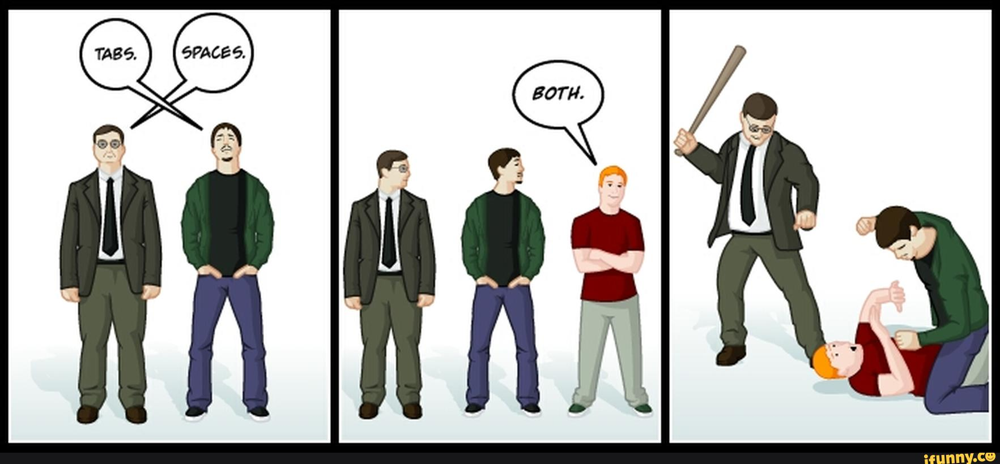
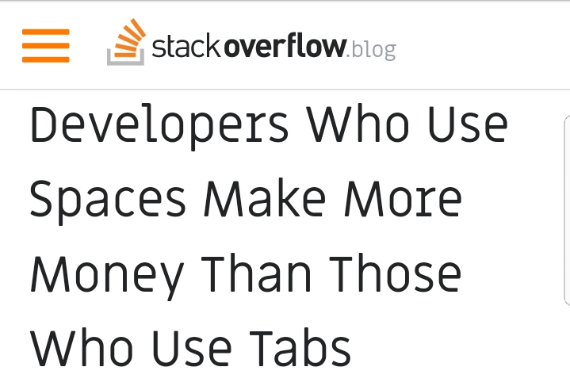

## Reason for this post

I, personally, have been struggled with this issue for some time. I am kinda person who has a really poor memory, but i am pretty sure i've googled it for at least twice, and each time, has spent decent amount of time on researching.

I really missed the old days When i was a (Notepad++❓❓❓Sublime Text2❗️❓or Atom❗️❗️) user who has a spirit of sticking to the original (default settings). But once you fell into some other "Linux/Unix born" 👻 editors, like Vi/Vim or Emacs, you normally will only have 2 choice, endless of suffering or save yourself.


## Advantage vs Disadvantage

### Space beats Tab
1. Space is widely used for aligning text, text alignment and formatting is useful especially for annotation and documentation.
2. Space share the same look across all different platforms while tab might look very different
3. Some languages enforces/strictly recommends stylish rules, like python(4 spaces indention), javascript(2 spaces indention), java(mostly 4 spaces indention) etc.

### Tab beats Space
1. Tab is highly customizable they can be changed to arbitrary values(3,4,8 etc) as the reader wants/used to.
2. It's obvious that tab helps save a lot of spaces when it comes to editing large files with multiple lines.


## Vim tab settings

- `expandtab`: applies to **write** mode only. Set/convert vim's `<tab>` to `<space>` in **insertion** mode. If set, it implies that that only space will be used for insertion all the time.
- `ts`: aka. tabstop, applies to **read** mode only. It denotes (# of columns) the `<tab>` character visually displays/appears in vim, by default it's 8 in most Unix/Linux Systems and **NOT** recommended to be changed for some printing and cross platform reasons.
- `sts`: aka. softtabstop, applies to **write** mode. It represents , in `insertion` mode, that pressing a `<tab>` key (# of columns) will be inserted.
	- if sts > ts: vim uses as many `<tab>` as possible and fill the rest with `<space>` to represents a `<tab>` press in `insertion` mode, for eg.setlocal sts = 20 ts = 8, then vim uses 2 `<tab>` + 4 `<space>` to represent a `<tab>` press.
	- elif sts < ts: vim fills (sts)# of `<space>` when pressing a `<tab>` in `insertion` mode.
- `sw`: aka. shiftwidth, denotes # of columns `>>` or `<<` equals to.
- `stab`: aka. smarttab, it tells vim to use `sw` for indention at the beginning of each line, whereas 'tabstop' and 'softtabstop' are used elsewhere.

### Some reference settings

From Vim wiki:

Create file html.vim(~/.vim/after/ftplugin/html.vim) with contents:
```
setlocal shiftwidth=2
setlocal tabstop=2
```

and file python.vim with contents:

```
setlocal expandtab
setlocal shiftwidth=4
setlocal softtabstop=4
```

or if `.vimrc` is preferred,

```
autocmd FileType html setlocal shiftwidth=2 tabstop=2
autocmd FileType python setlocal expandtab shiftwidth=4 softtabstop=4
```

My personal funky `.vimrc` settings

```
autocmd FileType * setlocal noexpandtab tabstop=4 shiftwidth=4 smarttab
autocmd BufNewFile,BufRead *.py setlocal expandtab tabstop=4 shiftwidth=4
autocmd BufNewFile,BufRead *.js setlocal expandtab shiftwidth=2 softtabstop=2
```

### Conclusion
In fact, the debate among space or tab is just like single quote or double quote, semicolon or nosemicolon. It's mainly a stylish problem which heavily relies on personal taste. Kinda like vim or emacs, years of debate will not help bring them to an end. From my personal shallow intuitive perspective, i will just follow something i am in favor of. As i've been using `<space>` over `<tab>` for some time(notice, i'm a js citizen, to be more precise, a js newbie👶), i find it could be fun to switch to the tribe of `<tab>` for a while.
